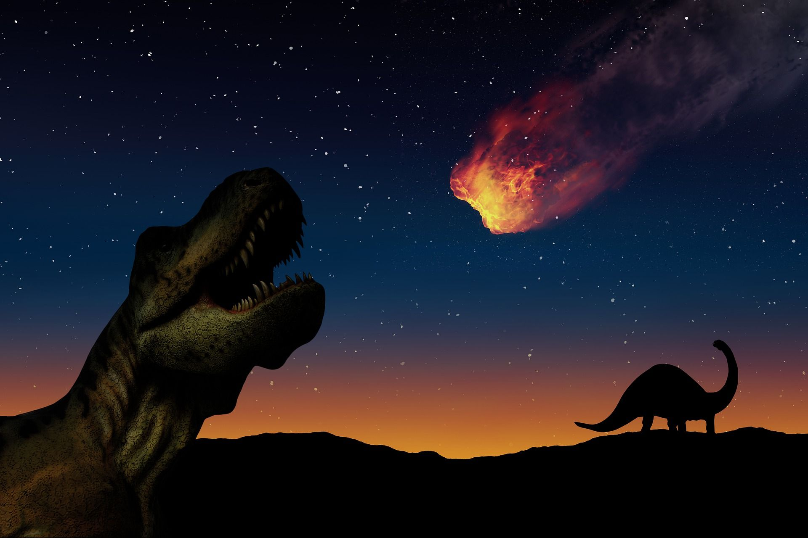

# Count_leap_years

## Story

Many, many years ago was the age of the dinosaurs... 🐱‍🐉

And then one day the Mr. Space 🌌 
sent a huge gift to planet Earth called a meteorite 🌠 Unfortunately it ended the age of the dinosaurs, but it created something new, something unique, something we now call HOME 🌍

And suddenly NASA 🚀 gets a task from Mr. Space, he asked

❗❗❗ mankind to count the number of leap_years from the beginning of our era to 2024 ❗❗❗

With the stipulation that the task must be completed, if not our HOME 🌍 will be destroyed 💥 again!

Good luck with the solution, the countdown starts now! ⏳

## Extra information ❗❗❗

Count the number of leap_years from the first year of our era to 2024 A.D. inclusive ➕
SAVE THE PLANET❗
Good luck 🍀
